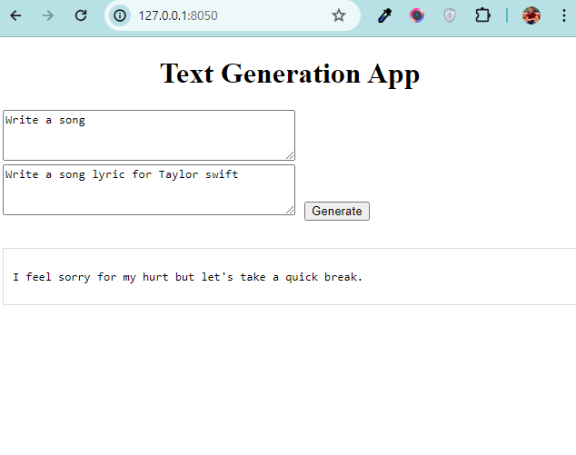

# Text Generation Application

This project develops a text generation application using state-of-the-art language models trained with specific datasets. The application is built using Dash, a Python web framework, which allows for interactive web applications.

## Task 1: Dataset

### Training Data
- **Source**: [Stanford ALPaCA Dataset](https://github.com/tatsu-lab/stanford_alpaca/blob/main/alpaca_data.json)
  - This dataset was utilized as the primary training data.

### Evaluation Data
- **Source**: [Hugging Face Datasets - ALPaCA Evaluation](https://huggingface.co/datasets/tatsu-lab/alpaca_eval)
  - This dataset was used for model evaluation to ensure the model's performance and accuracy.

## Task 2: Training

The language model was fine-tuned using the Supervised Fine-Tuning (SFT) method, employing the `Trainer` class from the Hugging Face Transformers library. The training was tailored to integrate seamlessly with the existing pre-structured code, ensuring efficient utilization of the ALPaCA dataset.

## Task 3: Web Application Development

The web application was developed using Dash to provide a user-friendly interface for real-time text generation. 

 
